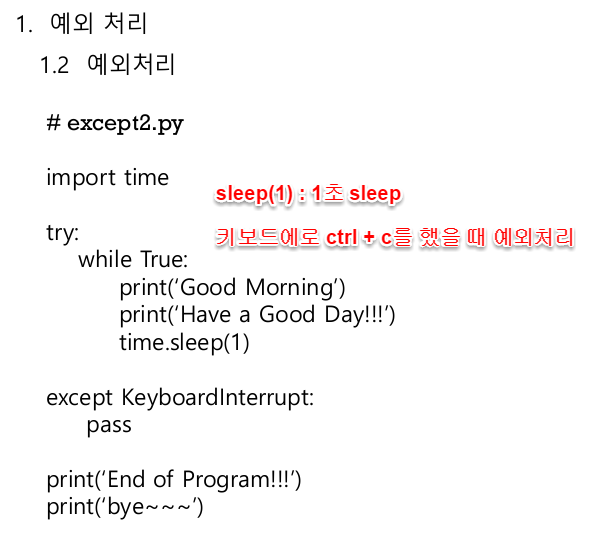

# 2020.06.06-1

## 1. 라즈베리파이 시작

1.  pdf 8page -  냉각 붙임
2. pdf26페이지    [https://www.raspberrypi.org/](https://www.raspberrypi.org/) 
3. 가장 full 버전을 받는다
4. 이미지파일을설치해주는파일 Win32DiskImager [https://sourceforge.net/projects/win32diskimager/](https://sourceforge.net/projects/win32diskimager/)
5. Win32DiskImager 실행 
6. pdf에 순서 써놓은 것 참조

